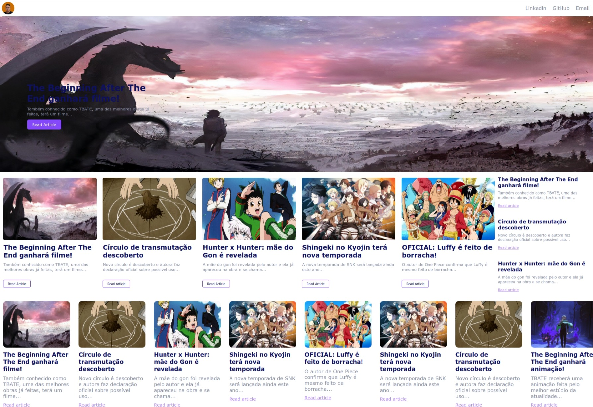
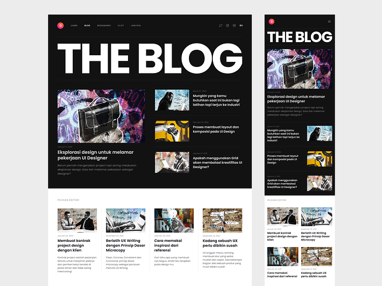
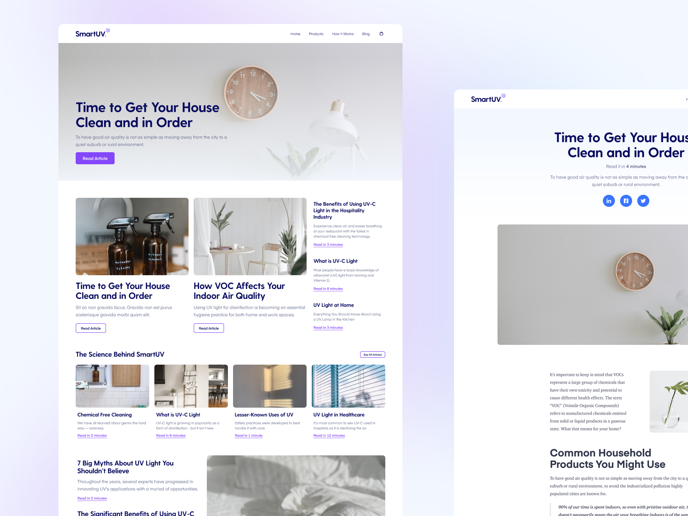
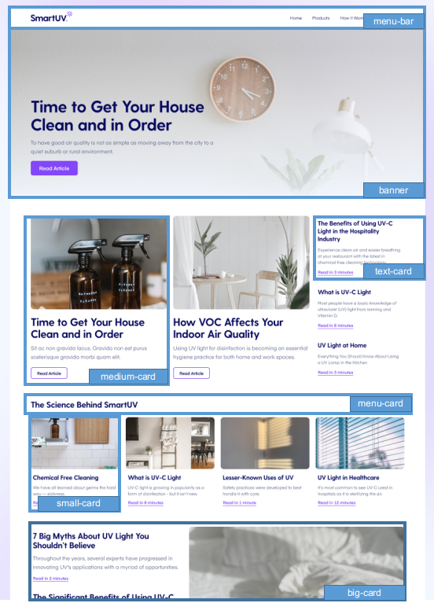

# Criando um Blog com Angular

## Índice

- [Criando um Blog com Angular](#criando-um-blog-com-angular)
  - [Índice](#índice)
  - [Sobre o projeto](#sobre-o-projeto)
  - [Preparando seu ambiente de produção e versionando no GitHub](#preparando-seu-ambiente-de-produção-e-versionando-no-github)
  - [Enxergando os componentes em Layout](#enxergando-os-componentes-em-layout)
  - [Criando a base dos componentes](#criando-a-base-dos-componentes)
  - [Criando a estrutura do big card](#criando-a-estrutura-do-big-card)
  - [Desacomplando os componentes da parte visual](#desacomplando-os-componentes-da-parte-visual)
  - [Criando outras páginas](#criando-outras-páginas)
  - [Pegando os dados dinâmicamente](#pegando-os-dados-dinâmicamente)
  - [Deixando a content Page Dinâmica](#deixando-a-content-page-dinâmica)
  - [Conclusão](#conclusão)

## Sobre o projeto

Projeto criado como desafio de projeto do curso de Angular da DIO.

Durante esse projeto teremos ajuda do professor com dicas desde como idealizar o projeto até as etapas de colocar o código em prática.

O resultado do projeto:



## Preparando seu ambiente de produção e versionando no GitHub

Durante o início da apresentação o professor comenta a importância de colocar as habilidades em prática e publicar pro mundo ver.

> Depois desse conteúdo nenhum dev será um James Bond, ou seja, agentes secretos que sabem mas não divulgam seu trabalho!
>

Como ter ideias para projetos?

Uma dica é usar o site Dribbble que é um portfólio público de layouts feitos por designers para nos inspirar a criar algo parecido. Podemos pesquisar pelo termo blog e ver o que aparece e nos interessa fazer.

Antes de começar a codar, é importante saber onde queremos chegar.

O professor utilizou o seguinte layout como base:



No meu caso, pensei em usar essa imagem:



Uma ferramenta sugerida para pegar as cores dos designs é a `just color picker`. No Windows ela serve apenas para pegar a cor de algum local da tela.

O próximo passo agora que temos a imagem de referência pega do `dribbble` e uma ferramenta par apegar as cores de referência, podemos começar a montar a estrutura do projeto (antes mesmo de iniciar o código).

## Enxergando os componentes em Layout

Uma dica para antes de começar é separar a imagem de ideia em componentes para tentar entender como o layout é composto.

Exemplo:



## Criando a base dos componentes

Antes de ir para os componentes é importante dar uma limpada nas sujeiras que o Angular traz, por exemplo, no arquivo html principal.

Agora podemos nos preocupar com as informações globais, como cor de fundo e etc. Podemos zerar as informações de margin, padding e border-box para não ter problemas de acordo com cada navegador.

Depois podemos criar todos os components com ajuda do CLI do Angular.

O próximo passo é começar a criar código em si.

## Criando a estrutura do big card

Para criar a estrutura dos arquivos podemos antes criar uma pasta chamada pages dentro do app.

Nessa pasta vamos adicionar as páginas para não precisar adicionar cada componente estático dentro do html principal.

Na pasta `pages` podemos gerar um componente chamado `home` e dentro desse componente adicionar o banner criado e também todos os demais componentes.

Pra inicio vamos adicionar uma seção onde ficarão armazenados os artigos do blog:


E dentro dessa div podemos adicionar outras para criar a estrutura de artigos do modelo:


## Desacomplando os componentes da parte visual

Nós seguimos os seguintes passos até o momento:

- Definimos os componentes
- Estilizamos os componentes

Agora vamos desacoplar os componentes para tornar os conteúdos dinâmicos.

Para essa etapa precisamos identificar quais detalhes do componentes precisam ser alterados.

Por exemplo:


Nesse destaque precisamos  modificar a imagem, o título e a descrição do conteúdo.

Com essa informação podemos modificar o código HTML do componente para receber a informação da classe TypeScript de forma dinâmica:


Com essa alteração precisamos incluir as variáveis na classe do typescript:


Adicionamos o decorator `Input()` para permitir que o componente pai realize o input da informação como atributo do componente filho, assim deixamos o componente dinâmico para o pai:


## Criando outras páginas

Com isso tudo feito, podemos criar uma outra página para acessar o conteúdo dinamicamente ao clicar no artigo.

Inicialmente podemos criar uma página chamada `content` como um componente dentro da pasta `pages`.

Após isso precisamos modificar o arquivo `app.component.html` para remover a linha onde chama o `app-component` e manter somente o `router-outlet` que servirá para fazer o gerenciamento de rotas que vamos criar.

Dentro do arquivo `app-routing.module.ts` podemos adicionar na variável `routes` (que é um vetor) os objetos que referenciam as rotas que teremos no site.

Por exemplo:


Repare que precisamos passar individualmente as rotas, mencionando o caminho com o `path` e depois o componente que será chamado com este caminho. Depois fechamos o objeto e adicionamos outro com a mesma estrutura.

Com isso podemos ver que ao não passar caminho nenhum a `home` será chamada e ao passarmos `content` o componente criado anteriormente será chamado:

Home:


Content:


Com isso feito, podemos fazer alguns ajustes dentro do component `content` que foi a página criada, adicionando e modificando toda a estrutura e layout.

HTML:

```html
<div class="container__content">
  <div class="content__cover">
    
  </div>

  <div class="content__title">
    <h1>Meu título</h1>
  </div>

  <div class="content__description">
    <p>Minha descrição</p>
  </div>

</div>
```

CSS:

```css
.container__content {
  width: 100%;
  height: 100vh;

  display: flex;
  flex-direction: column;

  margin-top: 10px;

  justify-content: center;
  align-items: center;
}

.content__cover > img{
  border: solid 3px black;
  border-radius: 10px;
  width: 500px;
  min-width: 500px;
  height: 300px;
}

.content__description > p{
color: rgb(78, 78, 78)
}
```

Com essa alteração feita, percebemos que o menu da barra superior fica apenas no componente `home` criado anteriormente, mas gostaria que ficasse em todas as páginas…

Sendo assim podemos remover o `HTML` e `CSS` do header (onde estava o menu de cabeçalho) da página home e ao invés de deixar dentro do componente podemos adicionar essas informações no `root`, assim elas serão passadas entre todas as páginas:

HTML:

```html
<header>
  <app-menu-bar></app-menu-bar>
</header>

<router-outlet>

</router-outlet>
```

CSS:

```css
*{
  /* Zerando configurações de margin, padding e tamanho da caixa para evitar problemas dependendo do navegador */
  margin: 0;
  padding: 0;
  box-sizing: border-box;

  /* Definindo cor de fundo */
  background-color: #ffffff;

}

header{
  border: 1px solid grey;
}
```

Depois de tudo podemos adicionar um botão para voltar do content para a home. Para isso adicionamos uma simples tag `a` mas ao invés de passar um href passamos o atributo `[routerLink]` para indicar qual rota gostaríamos de ir.

Como a rota para a home ficou descrita como uma string vazia, fica assim:


Agora adicionamos no arquivo TS da rota `content` as variáveis para armazenar as informações dinâmicamente:


Fazemos todas as modificações no HTML para comportar os valores das variáveis criadas.

Agora nós vamos criar uma pasta dentro da home para armazenar notícias fake afim de deixar o conteúdo mais dinâmico, e dentro da pasta adicionar um arquivo TS com um vetor que vai simbolizar uma api / banco de dados contendo as notícias:


Cada notícia será composta por um ID, uma photo, um título e uma descrição.

A ideia é que sempre que o usuário clicar em algum link ele será redirecionado para a rota de `content` e passará o `id` como parâmetro para puxar as informações da notícia.

Para isso funcionar também precisamos modificar as rotas de forma que a rota de conteúdo receba o id:


## Pegando os dados dinâmicamente

Agora precisamos fazer com que a home redirecione para a página de conteúdo de forma dinâmica.

Pra isso precisamos criar uma propriedade inputável de `id` dentro do componente filho, podendo começar com o `banner` (que também é uma notícia):


Com essa propriedade podemos ir no componente pai que é a `home` e adicionar a propriedade criada passando um valor (o id da notícia que vamos chamar):


Dessa forma teremos o bannercom o `newsId = 1`

No banner podemos editar o botão que serve para redirecionar para a leitura do artigo adicionando uma rota que redireciona para a rota `content` e passa o `id` como parâmetro:


Agora ao passar o mouse encima do botão de leitura da notícia, podemos ver que ele redireciona para a URL específica:


Agora podemos fazer as mesmas alterações nos demais componentes que são notícias.

Com tudo isso feito, podemos adicionar no arquivo TS do componente que será a página de conteúdo (content) as seguintes linhas:


A linha adicionada no método construtor serve para adicionar um parâmetro que faz a gestão das rotas e informações passadas.

A linha dentro do método `ngOnInit` apenas imprime no console o id que foi passado para a página `content`assim que essa página foi criada.

## Deixando a content Page Dinâmica

Para que o conteúdo seja carregado dinamicamente na página `content` precisamos modificar a linha onde imprimimos a `id` passada no console (feita anteriormente) para passar essa informação para a id do componente `content`, da seguinte forma:


Agora nós precisamos adicionar um método que servirá para armazenar as informações do conteúdo fake criado anteriormente de acordo com o id carregado na página de conteúdo.

Pra isso, criamos um método que irá filtrar o artigo do dataFake a partir do id recebido e irá armazenar as informações desse artigo nas propriedades dessa classe:


Com essa função criada nós precisamos chamar ela ao iniciar o componente e passar o id armazenado como atributo:


Com isso feito, já temos o conteúdo sendo carregado dinamicamente, bastando ter as informações armazenadas no arquivo dataFake:


Resultado em tela:


Conteúdo ao clicar:


## Conclusão

Com a finalização do layout e mais alguns ajustes (utilizei *ngFor para adicionar dinamicamente os componentes a partir do dataFake), o blog personalizado ficou da seguinte forma:


E com esse projeto inauguro meus projetos com Angular e inicio meu aprendizado deste framework.

Daqui pra frente tenho toda a base necessária para criar novos projetos e me aperfeiçoar com Angular.

Neste curso aprendi a:

- Idealizar o projeto
- Compartimentar os elementos para idealizar os componentes necessários
- Criar uma estrutura de projeto funcional e organizada (componentes e páginas)
- Utilizar os bidings do Angular para trabalhar com transferência de informação entre componentes, classes e elementos
- Entre diversos outros aprendizados e dicas práticas muito úteis para projetos futuros.

O código desenvolvido pelo professor pode ser encontrado [neste repositório do GitHub.](https://github.com/felipeAguiarCode/angular-blog)
